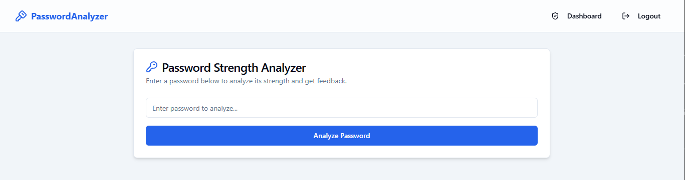
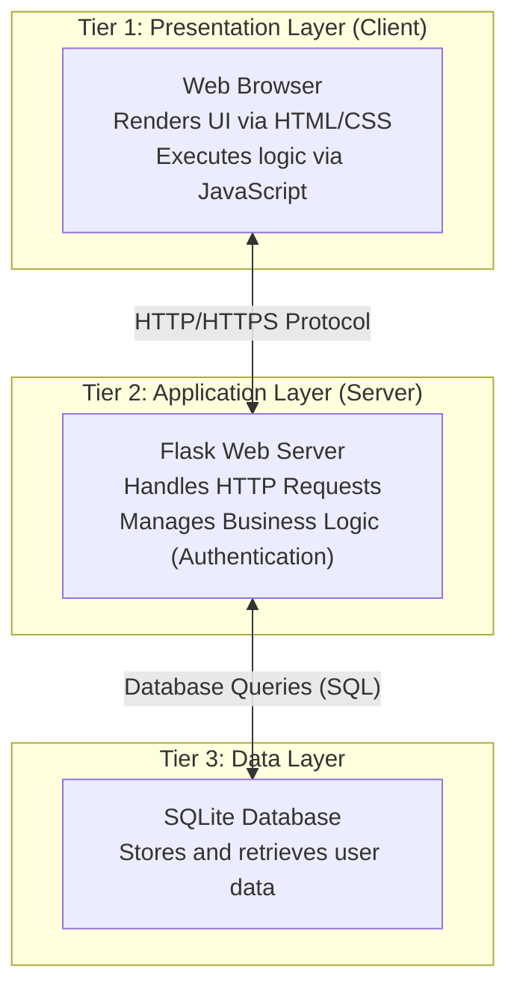
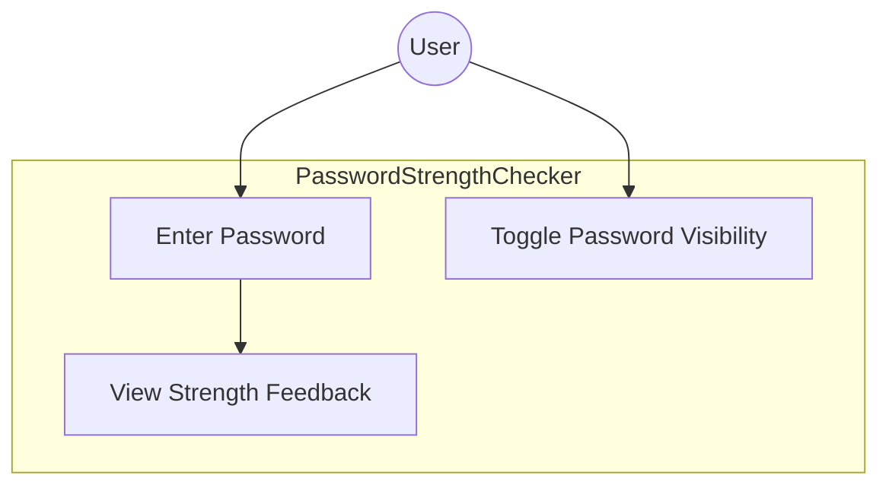
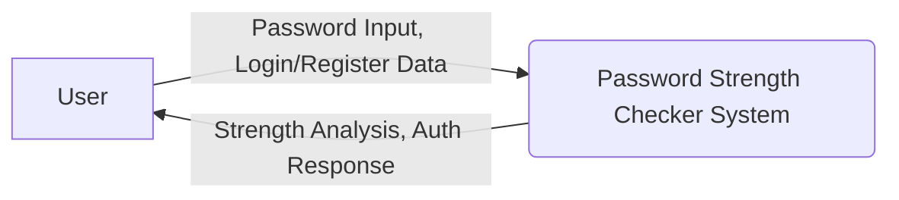
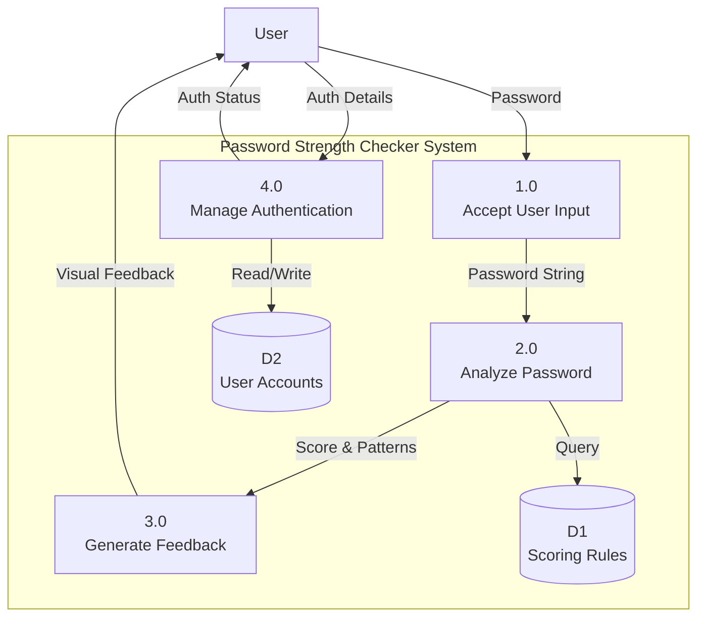
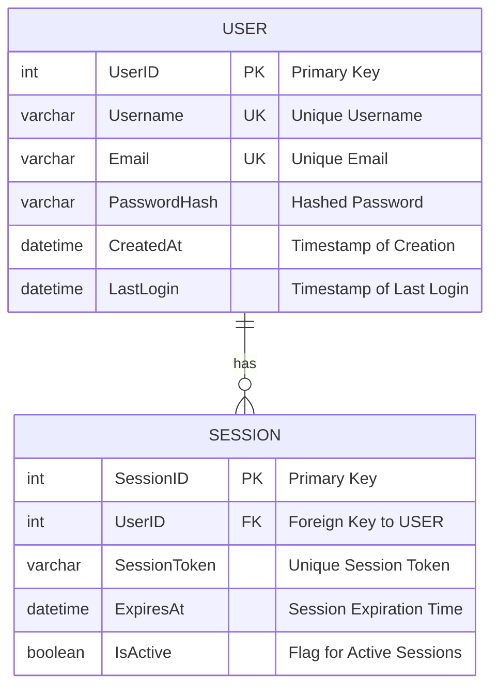

-----



<h1 align="center">Password Strength Checker</h1>

<p align="center">A full-stack web application for real-time password strength analysis.</p>

-----

## A Mini Project On: Password Strength Checker

A full-stack web application designed for real-time password strength analysis. This project provides users with immediate, comprehensive feedback to help them create stronger, more secure passwords using a modern tech stack.

**Submitted in partial fulfillment of the requirements for the Second Year B.Sc. in Computer Science (SYBSc CS).**

  - **College:** KPG College
  - **Submitted By:** `[]`
  - **Under the Guidance of:** `[Teacher]`

-----

## Project Abstract

In today's digital environment, strong passwords are the first line of defense for securing personal information. This project presents a **Password Strength Checker**, a full-stack web application developed to address the common issue of weak password creation. The application is built with **Next.js** for the frontend, and a **Node.js** server with **Express.js** for the backend logic and API. **MongoDB** is used as the database to store user and analysis data. It provides users with real-time, pattern-based analysis of their passwords, offering visual feedback and actionable suggestions for improvement. Registered users can also securely track their analysis history, promoting better long-term password hygiene.

-----

## Features

  - ✅ **Real-Time Strength Analysis:** The system evaluates password strength instantly as the user types.
  - 📊 **Visual Feedback System:** An intuitive progress bar and a detailed checklist provide clear feedback on password criteria.
  - 🔐 **Secure User Authentication:** A custom-built authentication system handles secure user sign-up, login, and session management.
  - 🗂️ **Personalized Analysis History:** Authenticated users can view a history of their past password checks, which are securely stored in the database.
  - 📱 **Responsive Design:** The user interface is fully responsive and optimized for both desktop and mobile devices.

-----

## Technology Stack

  - **Frontend:** Next.js, React, Tailwind CSS
  - **Backend:** Node.js, Express.js
  - **Database:** MongoDB
  - **Runtime Environment:** Node.js

-----

## Diagrams

### System Architecture



### Use Case Diagram


### Data Flow Diagrams

#### Context Diagram (DFD Level 0)



#### Level 1 DFD



### Entity Relationship Diagram



-----

## Getting Started

To set up and run this project locally, please follow the steps below.

### Prerequisites

  - Node.js (v18.x or later)
  - npm (or yarn)
  - MongoDB installed locally or a connection string for a cloud instance

### Installation and Setup

1.  **Clone the repository:**

    ```bash
    git clone https://github.com/uffamit/mini-project.git
    cd mini-project
    ```

2.  **Install project dependencies:**

    ```bash
    npm install
    ```

3.  **Configure Environment Variables:**

      - In the root directory, create a file named `.env.local`.
      - Add your database connection string and a secret for session management.
        ```env
        # .env.local - Environment Variables
        MONGO_URI="your_mongodb_connection_string"
        JWT_SECRET="your_super_secret_key_for_sessions"
        ```

-----

## Development

To run the application, start the development server:

```bash
npm run dev
```

Open [http://localhost:3000](https://www.google.com/search?q=http://localhost:3000) in your browser to view the running application.

-----

## License

This project is licensed under the MIT License.

-----

## Acknowledgement

We would like to express our sincere gratitude to our guide, **`[Teacher]`**, for their invaluable mentorship and support throughout this project. We are also thankful to the Department of Computer Science at **KPG College** for providing us with the necessary resources and a conducive environment for learning.
