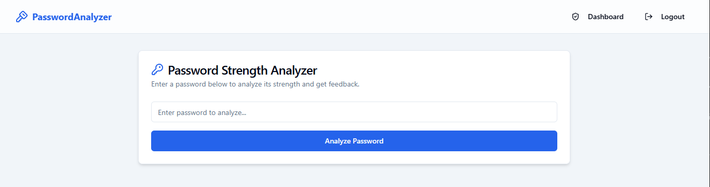
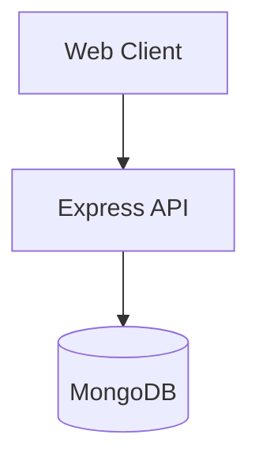

# PassGuard



<div align="center">

Real-Time Password Analysis • Authentication • Security Insights

</div>

---

## Overview

PassGuard is a web application for analyzing password strength in real time. It provides instant feedback, security recommendations, and password scoring to help users create stronger credentials.

The platform includes user authentication, password analysis history, and a responsive interface designed for both desktop and mobile devices.

## Features

### Password Analysis

* Real-time password strength evaluation
* Password complexity scoring
* Pattern and weakness detection
* Security recommendations
* Visual strength indicators
* Character requirement validation

### User Management

* User registration and login
* Secure password storage
* Session management
* Protected user accounts

### Analysis History

* Store previous password analyses
* Review historical results
* Track password quality improvements

### User Experience

* Responsive interface
* Mobile-friendly design
* Instant feedback
* Password visibility toggle

---

## Technology Stack

| Layer          | Technology               |
| -------------- | ------------------------ |
| Frontend       | Next.js, React           |
| Styling        | Tailwind CSS             |
| Backend        | Node.js, Express.js      |
| Database       | MongoDB                  |
| Authentication | JWT-based Authentication |
| Runtime        | Node.js                  |

---

## System Architecture


```mermaid
graph TD
    Client[Web Client]
    API[Express API]
    DB[(MongoDB)]

    Client --> API
    API --> DB
```

---

## Getting Started

### Prerequisites

* Node.js 18+
* npm
* MongoDB

### Installation

Clone the repository:

```bash
git clone https://github.com/your-username/passguard.git

cd passguard
```

Install dependencies:

```bash
npm install
```

Create an environment file:

```env
MONGO_URI=your_mongodb_connection_string
JWT_SECRET=your_jwt_secret
```

Start the development server:

```bash
npm run dev
```

Application URL:

```text
http://localhost:3000
```

---

## Environment Variables

| Variable   | Description               |
| ---------- | ------------------------- |
| MONGO_URI  | MongoDB connection string |
| JWT_SECRET | JWT signing secret        |

---

## Core Functionality

### Password Strength Evaluation

The application evaluates passwords based on:

* Length
* Uppercase characters
* Lowercase characters
* Numeric characters
* Special characters
* Common password patterns
* Overall complexity score

### Authentication

* User registration
* User login
* Session validation
* Protected routes

### Analysis History

Authenticated users can:

* View previous analyses
* Review scores
* Track password improvements

---

## Project Structure

```text
src/
├── app/
├── components/
├── lib/
├── server/
├── models/
├── routes/
└── utils/
```

---

## Development

Run development server:

```bash
npm run dev
```

Build for production:

```bash
npm run build
```

Start production build:

```bash
npm start
```

Lint code:

```bash
npm run lint
```

---

## License

MIT License

See the LICENSE file for details.
